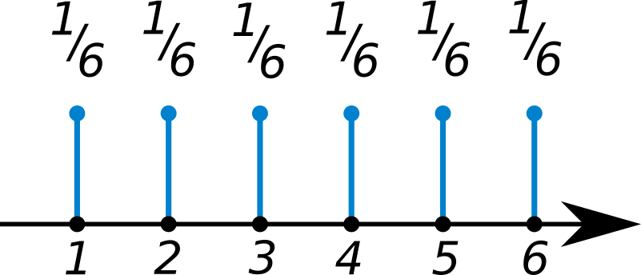
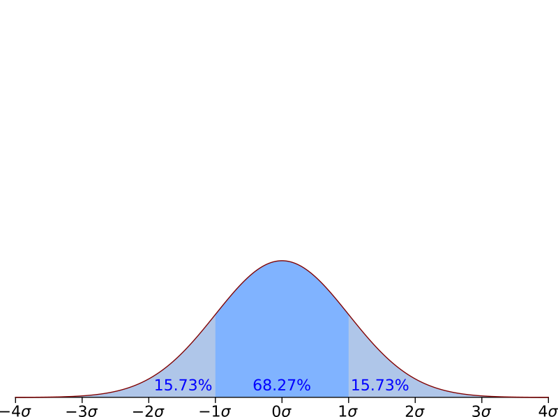
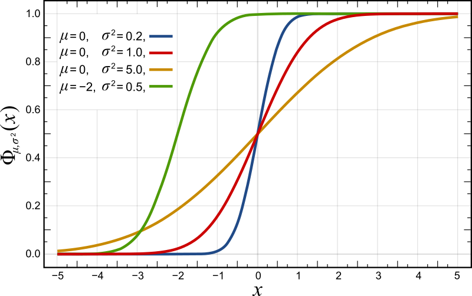
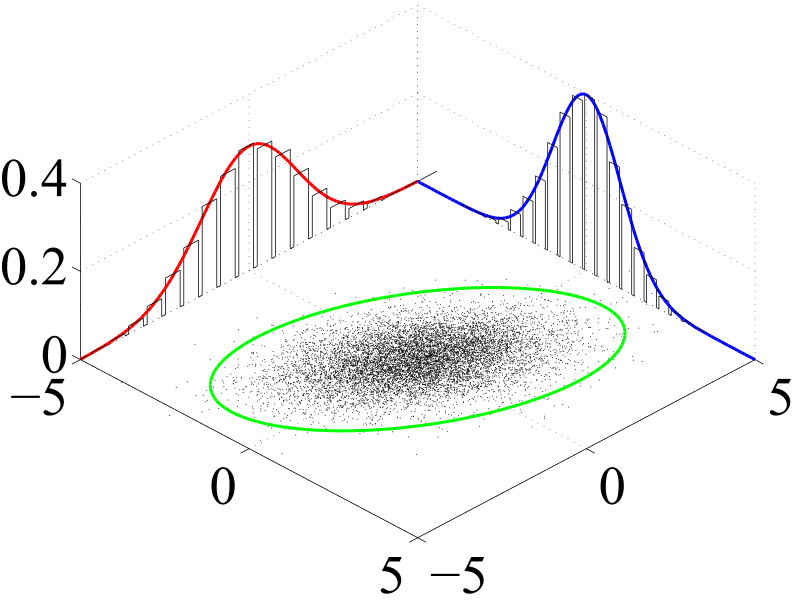

## Lesson plan
Today we will cover:

- Fundamentals of probability
    + Random variables
    + Probability distribution
    + Independence
    
- Programming

We will finish the class with some time for Q & A and for you to get started on exercises


# Probability

## Random variables

A random variable can take values from a set with an associated probability for each value.

## Bernouilli variable

A Bernouilli variable is a variable that can take values $0$ and $1$. With $p_1 = p$ and $p_0 = 1-p$

<div class = col1>
```{r, echo = FALSE, out.width = "35%", fig.retina = NULL, fig.align = 'right'}


```
</div>

<div class = col2>
<center>
```{r, echo = FALSE, out.width = '35%', fig.retina = NULL, fig.align = 'left'}
knitr::include_graphics("./img/coin_tail.png")

```
</center>
</div>


## Discrete variable

A discrete variable is a variable that can take a finite number of values. For example a variable that can take integer values from $1$ to $6$ is a discrete variable.

```{r, echo = FALSE, out.width = '40%', fig.retina = NULL, fig.align = 'center'}

```

## Continuous variable

A continuous variable is a variable that can take any values that fall within a certain interval. For example, the measure of height of a population of individuals is a continuous variable that can, theoretically, take any value in $\mathbb{R}$.


## Probability distribution

A probability distribution describes the probability of events associated to a random variable.
There are two general cases:

- discrete probability distribution
- continuous probability distribution


## Probability mass function

A discrete random variable has an associated probability mass function (pmf) which describes the probability distribution of the variable.

```{r, echo = FALSE, out.width = '40%', fig.retina = NULL, fig.align = 'center'}

```

Would you say that dice is fair?

## Probability density function

A continuous random variable has an associated probability density function (pdf).
A pdf does not give a direct probability, but the integral of the pdf over a certain range gives the probability that values of this random variable will fall within this range:

$$
P [a \le X \le b] = \int_a^b f_X(x) \, dx
$$


## Probability density function

```{r, echo = FALSE, out.width = '60%', fig.retina = NULL, fig.align = 'center'}

```


## Cumulative distribution function

The cumulative distribution function of a  real-valued random variable $X$ is the integral of the probability density function of $X$ and therefore indicate the size of the area under the pdf from $- \infty$ to $x$ for any value of $x$, which is the probability than $X$ takes a value inferior or equal to $x$


```{r, echo = FALSE, out.width = '60%', fig.retina = NULL, fig.align = 'center'}

```

## The normal distribution (simulated)

```{r, fig.align = 'center'}
library(ggplot2)
normal_dis <- data.frame(x = rnorm(n = 1000, mean = 0, sd = 1))
ggplot(data = normal_dis, aes(x)) + geom_density()
```

## The normal distribution (theoretical)

```{r, fig.align = 'center'}
ggplot(data.frame(x = c(-3, 3)), aes(x)) + stat_function(fun = dnorm)
```


## Joint distribution

A joint distribution defines the distribution of any given number of random variables.

```{r, echo = FALSE, out.width = '60%', fig.retina = NULL, fig.align = 'center'}

```

## Conditional probability distribution

Given two jointly distributed random variables, $X$ and $Y$, the conditional probility distribution of $Y$ given $X$ is the probability distribution function of $Y$ when $X$ is known.

This can be generalized to an arbitrary number, $n$, of variables, where the distribution for the variable of interest is conditional on all other distributions.

## Conditional probability distribution

For discrete random variables, the conditional mass function is:

$$
p_Y(y \mid X = x) = P(Y = y \mid X = x) = \frac{P(X = x \ \cap Y = y)}{P(X = x)}
$$
which is only defined for $P(X = x) \ge 0$.

For continuous random variables, the conditional density function is:

$$
f_Y(y \mid X = x) = \frac{f_{X, Y} (x, y)}{f_X (x)}
$$
where $f_{X, Y}$ is the joint density of $X$ and $Y$ and $f_X$ is the marginal density of $X$.


## Independence

Two random variables are independent if the conditional distribution of one given the other is equal to the marginal distribution of this variable.

For discrete variables:
$$
P(Y = y | X = x) = P(Y = y)
$$

For continuous variables:

$$
f_Y (y \mid X = x) = f_Y(y)
$$
for all relevant $x$ and $y$


## Properties of independence

Independence means that for discrete variables:

$$
P(X = x, Y = y) = P(X = x) P(Y = y)
$$
and, for continuous variables:

$$
f_{X, Y}(x, y) = f_X(x) f_Y(y)
$$

# R programming

## 

```{r, echo = FALSE}
library(vembedr)
embed_youtube(id = "C2kKdNBbz2M", height = 200, query = list(start = 3, 
                                                            end = 29, 
                                                            autoplay = 0,
                                                            rel = 0))
```


# R is cool!

## Why?

- R is a complete programming language
    + you can do statistics and more! (e.g. web scraping)
- the community is huge and growing!
    + lots of free code and packages
    + lots of places to find help
- many companies are seeking skilled R analysts!

```{r, echo = FALSE, out.width = '40%', fig.retina = NULL, fig.align = 'center'}
knitr::include_graphics("./img/Rlogo.png")
```

## Examples of things made with R

- Scientific papers
- [Websites](http://rmarkdown.rstudio.com/)
- Web apps: [example 1](https://gallery.shinyapps.io/premierLeague/), [example 2](https://mbienz.shinyapps.io/tourism_dashboard_prod/)
- these slides

## RStudio 

The standard R gui is underwhelming. [Rstudio](rstudio.com) offers lots of shortcuts and helpful integration:

* code completion
* git integration (more on this soon)
* debugging
* package development tools
* authoring (Rmarkdown, more on this soon)


You can learn more about RStudio (and R) by reading the [documentation](https://www.rstudio.com/online-learning/) on the RStudio website and by watching their [webinars](https://www.rstudio.com/resources/webinars/)

```{r, echo = FALSE, out.width = '20%', fig.retina = NULL, fig.align = 'center'}
knitr::include_graphics("./img/RStudio-Ball.png")
```

## RStudio projects

RStudio allows you to create projects which:

- conserve the state of your rsession
- you can customise your interface at the project level
- help with git integration


## Microsoft R

[Microsoft R](https://mran.revolutionanalytics.com/open/) (formerly Revolution Analytics) releases an enhanced version of R.

The main particularity of this distribution is multithreaded base math operations (e.g. matrix algebra)

You can do something similar yourself installing OpenBlas and compiling R from source.

```{r, echo = FALSE, out.width = '25%', fig.retina = NULL, fig.align = 'center'}
knitr::include_graphics("./img/MROlogo.png")
```

## Getting help with R

There are many places to get help with R. The main ones are:

- [Rseek](http://rseek.org), for a version of google that understands that R is not a letter.
- [Stack Overflow](http://stackoverflow.com/), for programming questions
- [Cross Validated](http://stats.stackexchange.com/), for statistics questions
- [R mailing lists](https://www.r-project.org/mail.html), for everything else

```{r, echo = FALSE, fig.height= 2.5, fig.align='center'}
library(ggplot2)
tag_count <- read.csv("rvspython.csv")
tag_count <- tag_count[tag_count[, "Tag.Name"] == "r",]
names(tag_count)[3] <- "nb_questions"
tag_count[, "Month"] <- as.POSIXct(tag_count[, "Month"], format = "%Y-%m-%d %H:%M:%S")
tag_count <- tag_count[2:nrow(tag_count),]
ggplot(tag_count, aes(x = Month, y = nb_questions)) + geom_line() + labs(x = "Date", y = "Number of Questions", title = "Monthly questions tagged \"r\" on StackOverflow")

```

## A cooler version of the previous graph

```{r, echo = FALSE, fig.align='center', message = FALSE}
library(plotly)
tag_count <- read.csv("rvspython.csv")
tag_count <- tag_count[tag_count[, "Tag.Name"] == "r",]
names(tag_count)[3] <- "nb_questions"
tag_count[, "Month"] <- as.POSIXct(tag_count[, "Month"], format = "%Y-%m-%d %H:%M:%S")
tag_count <- tag_count[2:nrow(tag_count),]
p <- ggplot(tag_count, aes(x = Month, y = nb_questions)) + geom_line() + labs(x = "Date", y = "Number of Questions", title = "Monthly questions tagged \"r\" on StackOverflow")

ggplotly(p)
```

# Version control | a very short introduction

## Git

Git is a version control software started by Linus Torvalds (of Linux's fame).

It allows you to track changes in your file on a specific project.

Useful when writing code:

- when things break, you can rewind to figure it out
- it makes collaboration easier
- it forces you to describe what you do (through commit messages)
- one day it will save you a lot of tears and pain

## Basics of Git

Git is integrated with RStudio:
   
- no need to use the shell
- but knowing how to use the shell is useful when things break
- you need to know a few functions:
    + git init
    + git add
    + git commit
    + git checkout

Learn more: [RStudio git integration](https://www.rstudio.com/resources/webinars/rstudio-essentials-webinar-series-managing-part-2/), an [intro to git and RStudio](https://jennybc.github.io/2014-05-12-ubc/ubc-r/session03_git.html)


## Bitbucket and Github

- Two platforms to host your code
- [Gitbub](https://github.com/): great for public code
- [Bitbucket](https://bitbucket.org/): great for non-public code (on an academic licence)
- Both use git and:
    + store your code remotely
    + allow you to collaborate with yourself and others

## R Markdown

R Markdown is a flavour of [Markdown](https://daringfireball.net/projects/markdown/)

It allows to write literate programming document that can be rendered in different format (e.g. HTML, PDF, Word)

We will use R Markdown documents heavily in this class (Usually, I will give you a template).

Because it is a text file, it can be version controlled.

## A note about formats

Schematically, there are two large families of formats:

- proprietary
- open

Open format are usually longer lived than proprietary format and because their specifications are public one could always write a new parser if needed.

## Text formats

Textual formats (.txt, .csv, .md, .Rmd, .html) are open formats. They have two main advantages:

- they are portable
- they can be easily version controlled

They present some disadvantages:

- not always compact
- might require extra code to load/write

```{r, eval = FALSE}
#for example, for a csv file:
data <- read.csv("./path/to/file.csv", stringsAsFactors = FALSE)

#for RData format
load("./path/to/file.RData")
```

# {.flexbox .vcenter}

Always code as if the guy who ends up maintaining your code will be a
violent psychopath who knows where you live. Code for readability.

John F Woods

## Coding style

Why do you need a coding style?

- Code is also read by humans
- Hard to read code, is less likely to be used
- You have to read your own code, save yourself some time by:
    + Following a style guide
    + Commenting your code heavily

There are plenty of coding style guides around. I find the [one](http://adv-r.had.co.nz/Style.html) in Hadley Wickham's book _Advanced R_ simple and effective.

## Short demo

- Creating an RStudio project
- Initializing a git repository using the RStudio integration
- Create a remote with github or bitbucket
- A minimal script
- A minimal RMarkdown document

## Exercises

- Create a project with RStudio
- Enable git version control
- Download the Rmd template for the first assignment
- Complete the assignment


# Supplementary material

# R basics

## Assignement

The assignement in R is not `=` it is `<-`

```{r, eval = FALSE}

an_object <- some_results_of_an_operation
```

## Vectors

A vector is a unidimensional data structure

```{r, eval = FALSE}
v <- c(1:5)
v

is.vector(v)
```

## Scalars

R does not have scalars so uses vector of length 1 instead to represent single numbers

```{r}
v <- 1
is.vector(v)

mode(v)

typeof(v)
```

## Matrices

Matrices are two dimensional arrays

```{r}
matrix <- matrix(data = c(1:6), nrow = 2, byrow = TRUE)

matrix
```

## Types

Matrix and vectors can only hold data of one type.
If you try to create a vector or matrix with data of different type, it will be of the type that allows to represent all elements of the matrix

```{r}
matrix1 <- matrix(data = c(1:6), nrow = 2, byrow = TRUE)
matrix2 <- matrix(data = c(1, 2, 3, 4, 5, 3.14), nrow = 2, byrow = TRUE)
matrix3 <- matrix(data = c(1:5, "Marmalade"), nrow = 2, byrow = TRUE)
```

## Types (con't)

```{r}
matrix1
matrix2
matrix3
```

## Types (con't)


```{r}
typeof(matrix1)
typeof(matrix2)
typeof(matrix3)
```

## Data frame

Data frames are two dimensional arrays (like matrices) but they can hold various types of data

```{r}
dt <- data.frame(name = c("Julia", "Simon", "George"), 
                 age = c(24, 26, 19), 
                 gender = c("Female", "Male", "Male"))
dt
```

## Data frame (con't)

Within each column, every element has to have the same type.

There are two important function that are useful with data frames (and other types):
`summary` and `str`

```{r}
summary(dt)

```


## Data frame (con't)

```{r}

str(dt)
```


## Lists

Lists are very useful because of their flexibility, but this also makes them sometimes difficult to work with.

Elements of a lists can be of any type (even list)

```{r}
l <- list(c(1:3), "Today", matrix(1:6, nrow = 2))
l
```

## Accessing elements of a list

Two ways: ``[[]]`` and `[]`, which do not produce the same result

```{r}
l[[1]]
l[1]
```
## Accessing elements of a list (con't) 

Two ways: ``[[]]`` and `[]`, which do not produce the same result

```{r}
typeof(l[[1]])
typeof(l[1])
```

## Missing values

R codes missing values as `NA`

It also has codes for not-a-number: `NaN`

And `NULL`

## Installing packages

Packages are installed with the function `install.packages()` and updated with `update.packages()`

```{r, eval = FALSE}
install.packages("Name of the package")
install.packages(c("Package_1", "Package_2"))

```

## Loading and writing data

Depending on the files, R offers a lot of facilities to load and write data.
We will explore some of them in the following few sessions.

CSV files can be easily read in and written using `read.csv` and `write.csv`

```{r, eval = FALSE}
data <- read.csv("Name_of_file.csv")
write.csv(Object_Name, "Path/to/file.csv")

```


# {.flexbox .vcenter}


